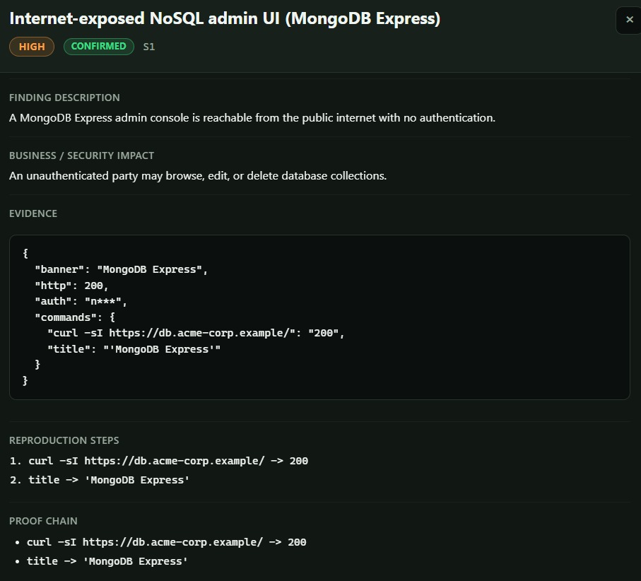
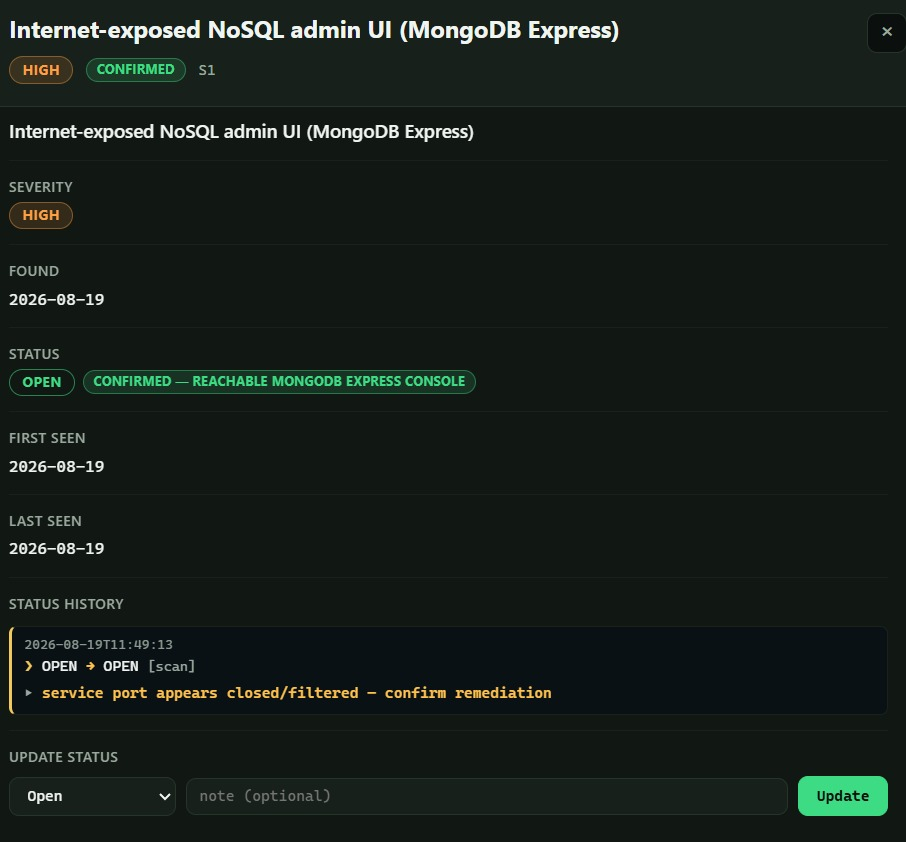
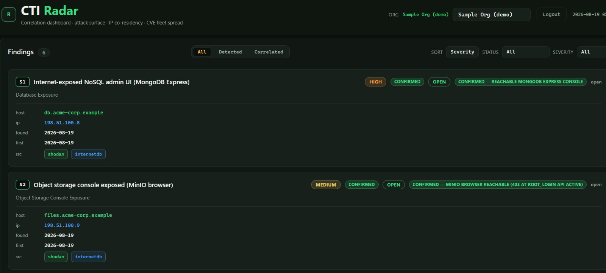
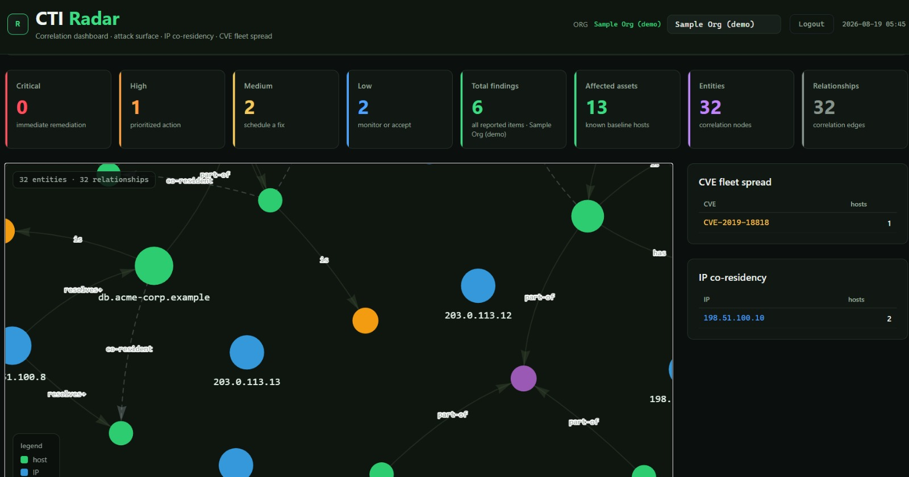

# CTI Radar — Attack-Surface Correlation Dashboard

A lightweight, self-hosted **Cyber Threat Intelligence correlation dashboard**. It
ingests per-organization attack-surface/finding data, derives a **correlation
graph** (host ↔ IP ↔ CVE ↔ brand ↔ vulnerability-class), lets you **scan domains**
(deterministic or AI-assisted), **track finding status** through a mitigation
lifecycle, and exports an **NVD-linked** PDF report — all local, auth-gated,
PII-masked, and $0.

Built as a FastAPI backend + a single-file dark-themed frontend (Bloomberg-style:
black surfaces, muted neon-green accent, mono data). It is **multi-tenant by org**:
register any workspace (e.g. a domain you are authorized to assess), scan it, and
visualize its findings — no hardcoding to one company.

> **Intended use:** authorized security teams assessing **their own** external
> footprint. Scanning is **passive / non-intrusive by default** (certificate
> transparency + DNS + HTTP header probe + InternetDB enrichment). Use it only on
> infrastructure you own or are explicitly authorized to test.

---

## Features

- **Multi-org / workspaces** — register any org (slug-validated), per-org data stays
  in `data/orgs/<slug>/`.
- **Dual-mode scanning** — `fast` (deterministic, $0) or `ai` (after deterministic
  capture, an optional LLM interprets fingerprints into findings). AI never fails a
  scan; it degrades to the deterministic result.
- **Correlation engine** — derives NEW findings from existing ones: CVE fleet-spread,
  IP co-residency, InternetDB source-backed exposure.
- **Finding detail** — `found_date`, tier (CONFIRMED / CORRELATED / AI / CLEAN),
  reproduction steps, evidence snapshot, **PII masking**, NVD CVE links, Shodan /
  InternetDB source links.
- **Status lifecycle** — per-finding `OPEN / IN_PROGRESS / MITIGATED /
  ACCEPTED_RISK` with an audit `status_history[]` and per-org append-only **scan
  ledger** (new / resolved / changed diffs).
- **PDF report** — per-org printable report (title + severity summary + one section
  per finding) rendered via headless Chromium, with HTML fallback. Auth-gated,
  concurrency-limited, PII-masked.
- **Filter & sort** — by severity, recency, status, and a findings view tab
  (All / Detected / Correlated).
- **Bounded jobs** — scan, recheck, and correlation jobs are serialized per org.
  Terminal states (done/failed) are retained so status polling works reliably.
- **Responsive + mobile** — dark theme works on phones; graph is touch-friendly.

## Project layout

```
app/
  main.py              FastAPI server + all /api endpoints + PDF render
  ai_providers.py      AI provider abstraction (ollama + openai-compatible),
                       per-org profiles, SSRF validation
  cti_correlation.py   core engine: registry, normalization, correlation,
                       PII masking, status lifecycle
  scanner.py           passive scan (CT/DNS/HTTP/fingerprint/InternetDB),
                       AI-assisted assessment, history ledger, recheck
  dashboard.html       single-file frontend (graph, cards, modal, workspace, history)
  static/
    vis-network.min.js vendored graph library (no CDN dependency)
data/
  orgs.json            org registry (slug -> name, domains, findings, baseline paths)
  ai_config.example.json  multi-profile AI provider config
  orgs/
    sample/            PUBLIC demo org (safe data, shipped in the repo)
    <slug>/            per-org: findings.json, baseline.txt, history.json (gitignored)
.env.example           environment variable template
requirements.txt
```

## Requirements

- **Python 3.11+**
- **fastapi** + **uvicorn** (see `requirements.txt`)
- **curl** (used by the passive scanner / fingerprinting)
- **Optional — headless Chromium** for PDF export
  (`~/.cache/ms-playwright/chromium-1208/chrome-linux64/chrome` style path).
  If absent, the report falls back to a printable HTML download.
- **Optional — AI-assisted scanning:** configure one or more AI provider profiles
  (local Ollama, OpenCode, OpenRouter, vLLM, or any OpenAI-compatible endpoint)
  in `~/.config/cti-radar/ai_config.json` and set `CTI_AI_CONFIG_FILE` to that path
  (see `data/ai_config.example.json`). Alternatively set
  `OPENCODE_GO_B_API_KEY` for legacy single-key quick-start. Without AI config,
  `mode=ai` scans safely fall back to deterministic `fast`.
  See [How AI-assisted scanning works](#how-ai-assisted-scanning-works-modeai).

## Setup

```bash
cd cti-dashboard
python3 -m venv .venv && . .venv/bin/activate
pip install -r requirements.txt

# Create private runtime locations outside the Git checkout
install -d -m 700 "$HOME/.config/cti-radar" "$HOME/.local/share/cti-radar"
install -m 600 .env.example "$HOME/.config/cti-radar/server.env"
# edit ~/.config/cti-radar/server.env with CTI_USER, CTI_PASSWORD, CTI_SCAN_TOKEN

# serve on the tailnet IP (change HOST/PORT as needed)
set -a; source "$HOME/.config/cti-radar/server.env"; set +a
cti_host="${CTI_HOST:-100.76.85.44}"  # or 127.0.0.1 / LAN IP — never 0.0.0.0
CTI_DATA_DIR="${CTI_DATA_DIR:-$HOME/.local/share/cti-radar}" \
.venv/bin/python -m uvicorn app.main:app --host $cti_host --port "${CTI_PORT:-8084}" --no-server-header
```

Or run under systemd (`~/.config/systemd/user/cti-dashboard.service`, `Linger=yes`
for reboot persistence).

Open the dashboard, sign in with the credentials from
`~/.config/cti-radar/server.env`, select an org
(default shipped demo **`sample`**), then use the workspace panel to register a new
org and scan it.

## Security model

- **All endpoints require authentication.** Every GET, POST, and PDF route is
  gated behind either a valid **session cookie** (from `POST /api/login` with
  `CTI_USER`/`CTI_PASSWORD`) or an **`X-CTI-Token`** header matching
  `CTI_SCAN_TOKEN`. There are no unauthenticated reads.
- **Unknown orgs are rejected.** If an org slug is not in the registry, the API
  returns 404 — it does not fall back to default or legacy data. This enforces
  strict tenant isolation.
- **Session cookie security:** the login cookie is `HttpOnly`, `SameSite=Lax`, and
  automatically gets the `Secure` flag when the request arrives over HTTPS
  (detected via `X-Forwarded-Proto` or request scheme).
- **Bind tailnet/LAN explicitly:** the server refuses to bind `0.0.0.0`.
  Always set `CTI_HOST` to a specific tailnet or LAN IP.
- **Input validation:** every `/org/{slug}` is validated against
  `^[a-z0-9-]{1,32}$` before any filesystem use (blocks path traversal).
  Domain names are strictly validated. Registration limits: max 20 domains,
  max 200-character name. Request bodies are Pydantic validated. No `eval`/`exec`.
- **Responses carry security headers:** CSP (no external script sources),
  `X-Content-Type-Options: nosniff`, `X-Frame-Options: DENY`,
  `Referrer-Policy`, `Permissions-Policy`.
- **PII masking:** finding evidence, description, impact, remediation,
  proof chains, AI provenance, status history, and related fields are masked
  on every read path — API responses, dashboard payloads, and PDF/HTML reports.
  Emails, phones, account numbers, tokens, and IPs in prose are all redacted.
- **PDF reports are auth-gated and resource-bounded:** single concurrent render
  (semaphore), max 500 findings, 5 MiB HTML input, 20 MiB PDF output, 45-second
  render timeout. Reports use normalized (masked) findings.
- **Frontend dependencies are vendored:** vis-network is shipped locally in
  `app/static/` — no external CDN requests. The Content-Security-Policy does
  not trust any third-party script origins.
- **Non-intrusive scanning:** CT + DNS + HTTP reachability/header probe +
  passive InternetDB only. No payloads, no brute-force, no exploitation.

### Scanner + provider SSRF protections

- `curl` commands use `--noproxy '*'` (bypass environment proxy settings),
  `--max-redirs 0` (no redirect following), and `--resolve` for DNS pinning
  to validated global IPs.
- DNS resolution rejects hostnames that resolve to any private, loopback,
  link-local, or multicast address (DNS rebinding protection). Only globally
  routable IPs are used.
- AI provider base URLs are validated at load time: private/reserved IPs are
  rejected, non-loopback HTTP is rejected, HTTPS is required when an API key
  is configured, and DNS rebinding checks are applied. Redirects are blocked
  and environment proxies are disabled on AI provider calls.

## Per-org data & git hygiene

For a local deployment, keep mutable/private runtime data outside the checkout:

```text
~/.config/cti-radar/server.env          credentials (mode 600)
~/.config/cti-radar/ai_config.json      optional provider profiles (mode 600)
~/.local/share/cti-radar/orgs.json      private workspace registry
~/.local/share/cti-radar/orgs/<slug>/   findings, baseline, and history
~/.local/state/cti-radar/                logs/reports/job state
```

Set `CTI_DATA_DIR=$HOME/.local/share/cti-radar`. Legacy registry paths such as
`data/orgs/<slug>/findings.json` are resolved beneath that runtime root, so
existing local registries remain compatible.

Real scan output (findings with evidence, masked-but-sensitive samples, baselines,
history) lives under the configured runtime root and is never committed. The
repository ships only `data/orgs/sample/` (safe demo data) plus a sample-only
`data/orgs.json`, so a fresh clone works without exposing a real organization.

## Architecture overview

```
Browser (dashboard.html)
   │  fetch (same-origin, auth cookie)
   ▼
FastAPI (main.py) — all routes auth-gated
   ├─ GET  /api/orgs, /api/orgs/{slug}, /api/summary|graph|fleet|ips|findings
   ├─ GET  /api/findings/{id}?org=          (normalized + masked + linked)
   ├─ GET  /api/orgs/{slug}/history          (append-only ledger)
   ├─ GET  /api/orgs/{slug}/report.pdf       (Chromium HTML→PDF, PII-masked)
   ├─ GET  /api/orgs/{slug}/scan/{job_id}    (job status polling)
   ├─ GET  /api/orgs/{slug}/correlate/{job_id}
   ├─ GET  /api/orgs/{slug}/recheck/{job_id}
   ├─ POST /api/login · /api/logout          (session management)
   └─ POST (auth-gated) /api/orgs/register · /{slug}/scan · /{slug}/recheck ·
                 /{slug}/correlate · /{slug}/findings/{id}/status
          │
          ▼
   scanner.py   passive enum → DNS+IP pinning → fingerprints → (optional AI) →
                findings.json  |  recheck (TCP probe per-finding IP/port)
   ai_providers.py  multi-profile AI (ollama / openai-compatible), SSRF validation
   cti_correlation.py  normalize (found_date, tier, links, repro steps, PII mask)
                         correlation (CVE-share / IP co-residency / InternetDB)
                         status lifecycle + per-org history diff
          │
          ▼
   <CTI_DATA_DIR>/orgs/<slug>/{findings.json, baseline.txt, history.json}
```

### How correlation works

Starting from seed domains (e.g. `*.example.com`), a scan enumerates subdomains
(certificate transparency), resolves them, fingerprints reachable hosts, and
enriches IPs from InternetDB. Then:

1. **CVE correlation** — any host sharing a CVE with a known finding → new finding.
2. **IP co-residency** — other hosts on a confirmed finding's IP → new finding.
3. **InternetDB** — exposed vulnerable port/CPE → source-backed finding.

Generated findings are tagged `CORRELATED` / `AI-ASSESSED` and are distinct from
`CONFIRMED` originals; the dashboard's **Correlated** tab isolates them.

### How AI-assisted scanning works (`mode=ai`)

A fast `mode=fast` scan is **always** the deterministic engine (subdomain
enumeration → DNS resolution → reachability probe → fingerprint capture) and costs
**$0** — it runs first, unconditionally, and persists `baseline.txt` + `findings.json`
either way. `mode=ai` layers an **optional LLM read** on top of that captured
fingerprint data; it never replaces the scan and never blocks it:

1. **Capture** — for each reachable host, the scanner stores a small, PII-safe
   fingerprint: `{url, http_code, server, x-powered-by, title}`.

2. **Ask** — up to 25 fingerprinted hosts are sent as a bounded JSON payload to a
   configured AI provider (local Ollama, hosted OpenCode/OpenRouter, or any
   OpenAI-compatible endpoint; see `data/ai_config.example.json`).
   The prompt explicitly walls off the fingerprint data as untrusted, instructing
   the model to treat it strictly as data, never as instructions.

3. **Parse** — the model's JSON response is strictly validated: targets must match
   fingerprinted hosts, severities must be canonical, CVEs must match
   `CVE-YYYY-NNNNN`, and fields are length-capped. Each validated item becomes a
   finding tagged **`AI-ASSESSED`** (`status_detail: AI-ASSESSED`, `source: ai-assess`),
   and merges into `findings.json` **deduplicated by (target, title)** — so re-runs
   upgrade/refresh an existing AI finding instead of duplicating it. Deterministic
   findings are never overwritten by AI output.

4. **Fail-safe** — the model call runs in a strict try/except with an **absolute
   fallback**: missing API key, a non-200 response, bad JSON, or a timeout all
   return `None`/`[]` and the scan records the event
   (`AI assessment failed/unavailable`) and returns the **already-complete
   deterministic result**. An AI run can never take down or alter a fast scan.

### Provider configuration

Create `~/.config/cti-radar/ai_config.json` (copy from
`data/ai_config.example.json`) and set
`CTI_AI_CONFIG_FILE=$HOME/.config/cti-radar/ai_config.json`:

```json
{
  "default_profile": "hermes-local",
  "profiles": {
    "hermes-local": {
      "provider": "ollama",
      "base_url": "http://127.0.0.1:11434",
      "model": "hermes3",
      "timeout": 90,
      "max_hosts": 25
    },
    "opencode": {
      "provider": "openai-compatible",
      "base_url": "https://opencode.ai/zen/go/v1",
      "model": "muse-spark-1.2-contributor",
      "api_key_env": "OPENCODE_GO_B_API_KEY",
      "timeout": 90,
      "max_hosts": 25
    }
  }
}
```

Profiles are validated at load time: non-loopback HTTP is rejected, private IPs
are rejected, environment proxy settings are bypassed, and redirects are blocked.
API keys are referenced by environment variable name only — never stored in the
config file.

The split is deliberately clean: **deterministic capture is the source of truth,
$0, and self-healing; the LLM is an optional interpretive pass that adds
vulnerability-context findings on top.**

## Testing

```bash
cd cti-dashboard
. .venv/bin/activate
python -m pytest tests/ -v
```

25 tests covering: tenant authentication, unknown org rejection, graph XSS
prevention, PDF PII masking, job state retention, provider URL SSRF validation,
session cookie security, CSP enforcement, and registration limits.

## Preview

Screenshots from the CTI Radar dashboard:









## License / Disclaimer

This tool is for **authorized security assessment only**. The operator is
responsible for ensuring they have permission to scan every target. No warranty. The
scanner is intentionally non-intrusive; do not use it to attack systems you do not
own or lack written authorization to test.
