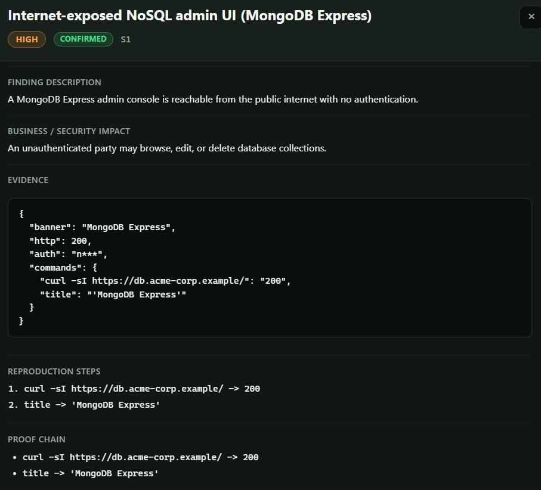
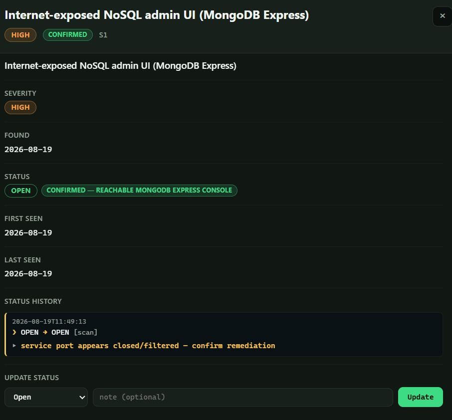
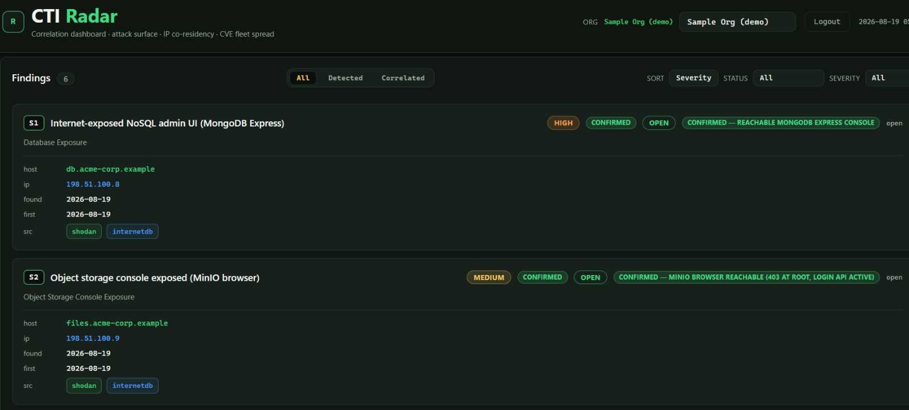
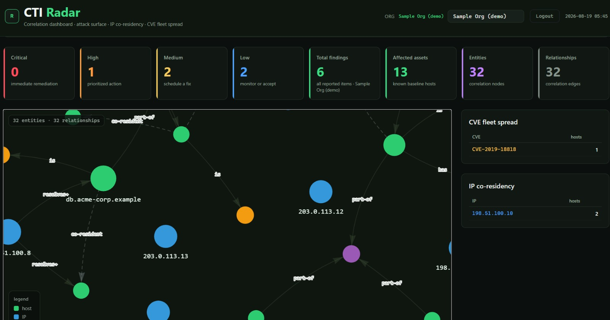

# CTI Radar — Attack-Surface Correlation Dashboard

A lightweight, self-hosted **Cyber Threat Intelligence correlation dashboard**. It
ingests per-organization attack-surface/finding data, derives a **correlation
graph** (host ↔ IP ↔ CVE ↔ brand ↔ vulnerability-class), lets you **scan domains**
(deterministic or AI-assisted), **track finding status** through a mitigation
lifecycle, and exports an **NVD-linked** PDF report — all local, auth-gated,
PII-masked, and $0.

Built as a FastAPI backend + a single-file dark-themed frontend (Bloomberg-style:
black surfaces, muted neon-green accent, mono data). It is **multi-tenant by org**:
register any workspace (e.g. a domain you are authorized to assess), scan it, and
visualize its findings — no hardcoding to one company.

> **Intended use:** authorized security teams assessing **their own** external
> footprint. Scanning is **passive / non-intrusive by default** (certificate
> transparency — crt.name / crt.sh / certspotter / hackertarget — plus DNS
> resolution, HTTP header probe, a TCP connect scan of common service ports, and
> InternetDB enrichment). Active probing (Nuclei templates, OpenHack) is
> deny-by-default and additionally gated behind `CTI_VULN_*` / `CTI_OPENHACK_*`
> authorization. Use it only on infrastructure you own or are explicitly
> authorized to test.

---

## Features

- **Multi-org / workspaces** — register any org (slug-validated), per-org data stays
  in `data/orgs/<slug>/`.
- **Dual-mode scanning** — `fast` (deterministic, $0) or `ai` (after deterministic
  capture, an optional LLM triages only the interesting hosts into `AI-ASSESSED`
  findings, then re-grades existing findings' severity/impact). AI never fails a
  scan; it degrades to the deterministic result.
- **OpenHack active assessment (separate from passive CTI scans)** — the
  `/openhack-scan` endpoint is fail-closed behind a server-level operator gate,
  exact target allowlist, and time-bounded ROE.
- **Model config without JSON** — dashboard **models** section (add/edit/test/
  delete, generic fields), single-profile `CTI_AI_*` env, or
  `python -m app.ai_setup --wizard`. All additive: existing profiles and the
  default are preserved; keys stay in server env. The AI scan option names its
  exact blocker (e.g. which key env is missing) instead of failing silently.
- **Host vuln lookup** — `Vuln scan` (org-wide) or `vuln: this host` reuses stored
  fingerprints: offline CVE map + version/header/TLS/login audit, passive by
  default. Optional **Nuclei engine** (`engine: nuclei`, fail-closed behind the
  `CTI_VULN_*` gate) runs community templates over in-scope URLs; findings are
  `NUCLEI-MATCHED`, capped at HIGH, `dos`/`fuzz` always excluded.
- **Passive service discovery** — for each resolved host/IP the scanner performs a
  TCP connect scan of common service ports (ssh, rdp, mysql, …), surfacing exposed
  services without payloads or banner grabbing.
- **Six passive enumeration sources** — certificate transparency (crt.name /
  crt.sh / certspotter) plus hackertarget, **Wayback Machine CDX** and
  **AlienVault OTX passive DNS**, so hosts that never had a TLS certificate are
  still found. **Wildcard-DNS filtering** drops names that only echo a `*.` record.
- **Offline version→CVE matching** — software versions parsed from headers,
  titles and service banners (SSH/FTP/SMTP/MySQL) are matched against a vendored
  high-impact CVE map (`app/cve_data.json`, 22 products / 36 CVEs). Matches are
  tiered **CORRELATED** with an explicit verify caveat and confidence
  (LOW/MED) badges — deterministic, offline, $0. Optional **NVD 2.0
  enrichment** (`CTI_NVD_ENRICH=1`) adds official CVSS score/vector,
  disk-cached and fail-open.
- **Security-header findings** — missing HSTS/CSP/X-Frame-Options/
  X-Content-Type-Options on reachable hosts (HSTS/CSP only expected on HTTPS;
  auth surfaces bumped to MEDIUM).
- **New-exposure diffing** — every scan is diffed against the previous scan's
  baseline: newly resolved hosts and newly open service ports become
  CONFIRMED findings, so attack-surface growth is tracked over time. A
  dashboard quick-filter isolates them.
- **TLS certificate inspection** — stdlib handshake (no payload) on HTTPS hosts:
  expired and self-signed certificates become deterministic findings.
- **Correlation engine** — derives NEW findings from existing ones: CVE fleet-spread,
  IP co-residency, InternetDB source-backed exposure.
- **Finding detail** — `found_date`, tier (CONFIRMED / CORRELATED / AI / CLEAN),
  reproduction steps, evidence snapshot, **PII masking**, NVD CVE links, Shodan /
  InternetDB source links.
- **Status lifecycle** — per-finding `OPEN / IN_PROGRESS / MITIGATED /
  ACCEPTED_RISK` with an audit `status_history[]` and per-org append-only **scan
  ledger** (new / resolved / changed diffs).
- **PDF report** — per-org printable report (title + severity summary + one section
  per finding) rendered via headless Chromium, with HTML fallback. Auth-gated,
  concurrency-limited, PII-masked.
- **Filter & sort** — by severity, recency, status, and a findings view tab
  (All / Detected / Correlated).
- **Bounded jobs** — scan, recheck, correlation, vuln lookup, AI grade, and
  OpenHack jobs are serialized per org.
  Terminal states (done/failed) are retained so status polling works reliably.
- **Responsive + mobile** — dark theme works on phones; graph is touch-friendly.

## Project layout

```
app/
  main.py              FastAPI server + all /api endpoints + PDF render
  ai_providers.py      AI provider abstraction (ollama + openai-compatible),
                       per-org profiles, SSRF validation, generic CRUD helpers
  ai_setup.py          CLI wizard for model config (`--list/--wizard/--check/--test`)
  cve_match.py         offline version->CVE matching + optional NVD enrichment
  cve_data.json        vendored high-impact CVE map (deterministic, offline)
  cti_correlation.py   core engine: registry, normalization, correlation,
                       PII masking, status lifecycle
  scanner.py           passive scan (6 enum sources, wildcard filter, DNS,
                       HTTP fingerprint, TCP service-port probe, banner
                       versions, TLS certs, InternetDB, baseline diff),
                       AI triage, recheck
  vuln_scan.py         host-based vuln lookup (passive CVE/config audit, gated active)
  nuclei_scan.py       Nuclei template provider (gated active engine for vuln-scan)
  dashboard.html       single-file frontend (graph, cards, modal, workspace, history)
  static/
    vis-network.min.js vendored graph library (no CDN dependency)
data/
  orgs.json            org registry (slug -> name, domains, findings, baseline paths)
  ai_config.example.json  multi-profile AI provider config
  orgs/
    sample/            PUBLIC demo org (safe data, shipped in the repo)
    <slug>/            per-org: findings.json, baseline.txt, history.json (gitignored)
.env.example           environment variable template
requirements.txt
```

## Requirements

- **Python 3.11+**
- **fastapi** + **uvicorn** (see `requirements.txt`)
- **One process on one host.** State is JSON files guarded by process-local
  locks with in-memory sessions/jobs — multiple workers or two instances
  sharing a data directory can lose updates. See
  [DEPLOYMENT.md](DEPLOYMENT.md) for the supported shape, hardened systemd
  unit, and reverse-proxy/trusted-proxy notes.
- **curl** (used by the passive scanner / fingerprinting)
- **Optional — headless Chromium** for PDF export
  (`~/.cache/ms-playwright/chromium-1208/chrome-linux64/chrome` style path).
  If absent, the report falls back to a printable HTML download.
- **Optional — AI-assisted scanning:** add one or more AI provider profiles via
  the dashboard **models** section, via `CTI_AI_*` env vars, or via
  `python -m app.ai_setup --wizard` (local Ollama, or any OpenAI-compatible
  endpoint; see `data/ai_config.example.json` for the file shape).
  Secrets are referenced by env-var name only, never stored in config.
  Without AI config, `mode=ai` scans safely fall back to deterministic `fast`.
  See [How AI-assisted scanning works](#how-ai-assisted-scanning-works-modeai).

## Setup

```bash
cd cti-dashboard
python3 -m venv .venv && . .venv/bin/activate
pip install -r requirements.txt

# Create private runtime locations outside the Git checkout
install -d -m 700 "$HOME/.config/cti-radar" "$HOME/.local/share/cti-radar"
install -m 600 .env.example "$HOME/.config/cti-radar/server.env"
# edit ~/.config/cti-radar/server.env with CTI_USER, CTI_PASSWORD, CTI_SCAN_TOKEN

# Serve on loopback by default; set CTI_HOST in the private env file to a
# specific private interface address when remote access is required.
set -a; source "$HOME/.config/cti-radar/server.env"; set +a
cti_host="${CTI_HOST:-127.0.0.1}"  # never 0.0.0.0
CTI_DATA_DIR="${CTI_DATA_DIR:-$HOME/.local/share/cti-radar}" \
.venv/bin/python -m uvicorn app.main:app --host $cti_host --port "${CTI_PORT:-8084}" --no-server-header
```

Or run under systemd (`~/.config/systemd/user/cti-dashboard.service`, `Linger=yes`
for reboot persistence).

Open the dashboard, sign in with the credentials from
`~/.config/cti-radar/server.env`, select an org
(default shipped demo **`sample`**), then use the workspace panel to register a new
org and scan it.

## Security model

- **All endpoints require authentication.** Every GET, POST, and PDF route is
  gated behind either a valid **session cookie** (from `POST /api/login` with
  `CTI_USER`/`CTI_PASSWORD`) or an **`X-CTI-Token`** header matching
  `CTI_SCAN_TOKEN`. There are no unauthenticated reads.
- **Unknown orgs are rejected.** If an org slug is not in the registry, the API
  returns 404 — it does not fall back to default or legacy data. This enforces
  strict tenant isolation.
- **Session cookie security:** the login cookie is `HttpOnly`, `SameSite=Lax`, and
  automatically gets the `Secure` flag when the request arrives over HTTPS
  (detected via `X-Forwarded-Proto` or request scheme).
- **Bind tailnet/LAN explicitly:** the server refuses to bind `0.0.0.0`.
  Always set `CTI_HOST` to a specific tailnet or LAN IP.
- **Input validation:** every `/org/{slug}` is validated against
  `^[a-z0-9-]{1,32}$` before any filesystem use (blocks path traversal).
  Domain names are strictly validated. Registration limits: max 20 domains,
  max 200-character name. Request bodies are Pydantic validated. No `eval`/`exec`.
- **Responses carry security headers:** CSP (no external script sources),
  `X-Content-Type-Options: nosniff`, `X-Frame-Options: DENY`,
  `Referrer-Policy`, `Permissions-Policy`.
- **PII masking:** finding evidence, description, impact, remediation,
  proof chains, AI provenance, status history, and related fields are masked
  on every read path — API responses, dashboard payloads, and PDF/HTML reports.
  Emails, phones, account numbers, tokens, and IPs in prose are all redacted.
- **PDF reports are auth-gated and resource-bounded:** single concurrent render
  (semaphore), max 500 findings, 5 MiB HTML input, 20 MiB PDF output, 45-second
  render timeout. Reports use normalized (masked) findings.
- **Frontend dependencies are vendored:** vis-network is shipped locally in
  `app/static/` — no external CDN requests. The Content-Security-Policy does
  not trust any third-party script origins.
- **Non-intrusive scanning by default:** certificate transparency (crt.name / crt.sh / certspotter / hackertarget) + DNS + HTTP
  reachability/header probe + service banner capture + TCP connect scan of common service ports +
  passive InternetDB only. No payloads, no brute-force, no exploitation.
  Active probing exists only behind explicit fail-closed gates: the Nuclei
  vuln-scan engine (`CTI_VULN_*`) and OpenHack (`CTI_OPENHACK_*`) — both deny
  by default and require written authorization scope.

### Scanner + provider SSRF protections

- `curl` commands use `--noproxy '*'` (bypass environment proxy settings),
  `--max-redirs 0` (no redirect following), and `--resolve` for DNS pinning
  to validated global IPs.
- DNS resolution rejects hostnames that resolve to any private, loopback,
  link-local, or multicast address (DNS rebinding protection). Only globally
  routable IPs are used.
- AI provider base URLs are validated at load time: private/reserved IPs are
  rejected, non-loopback HTTP is rejected, HTTPS is required when an API key
  is configured, and DNS rebinding checks are applied. Redirects are blocked
  and environment proxies are disabled on AI provider calls.

## Per-org data & git hygiene

For a local deployment, keep mutable/private runtime data outside the checkout:

```text
~/.config/cti-radar/server.env          credentials (mode 600)
~/.config/cti-radar/ai_config.json      optional provider profiles (mode 600)
~/.local/share/cti-radar/orgs.json      private workspace registry
~/.local/share/cti-radar/orgs/<slug>/   findings, baseline, and history
~/.local/state/cti-radar/                logs/reports/job state
```

Set `CTI_DATA_DIR=$HOME/.local/share/cti-radar`. Legacy registry paths such as
`data/orgs/<slug>/findings.json` are resolved beneath that runtime root, so
existing local registries remain compatible.

Real scan output (findings with evidence, masked-but-sensitive samples, baselines,
history) lives under the configured runtime root and is never committed. The
repository ships only `data/orgs/sample/` (safe demo data) plus a sample-only
`data/orgs.json`, so a fresh clone works without exposing a real organization.

## Architecture overview

```
Browser (dashboard.html)
   │  fetch (same-origin, auth cookie)
   ▼
FastAPI (main.py) — all routes auth-gated
   ├─ GET  /api/orgs, /api/orgs/{slug}, /api/summary|graph|fleet|ips|findings
   ├─ GET  /api/findings/{id}?org=          (normalized + masked + linked)
   ├─ GET  /api/orgs/{slug}/history          (append-only ledger)
   ├─ GET  /api/orgs/{slug}/report.pdf       (Chromium HTML→PDF, PII-masked)
   ├─ GET  /api/orgs/{slug}/scan/{job_id}    (job status polling)
   ├─ GET  /api/orgs/{slug}/correlate/{job_id}
   ├─ GET  /api/orgs/{slug}/recheck/{job_id}
   ├─ GET  /api/orgs/{slug}/vuln-scan/{job_id} (host vuln lookup status)
   ├─ GET  /api/vuln/engines                   (passive/nuclei availability)
   ├─ GET  /api/ai/profiles · /api/ai/capabilities (model config + readiness)
   ├─ POST /api/login · /api/logout          (session management)
   └─ POST (auth-gated) /api/orgs/register · /{slug}/scan · /{slug}/recheck ·
                 /{slug}/correlate · /{slug}/vuln-scan · /{slug}/ai-grade ·
                 /{slug}/findings/{id}/status · /ai/profiles · /ai/default · /ai/test
          │
          ▼
   scanner.py   passive enum → DNS+IP pinning → fingerprints → (optional AI) →
                findings.json  |  recheck (TCP probe per-finding IP/port)
   ai_providers.py  multi-profile AI (ollama / openai-compatible), SSRF validation
   cti_correlation.py  normalize (found_date, tier, links, repro steps, PII mask)
                         correlation (CVE-share / IP co-residency / InternetDB)
                         status lifecycle + per-org history diff
          │
          ▼
   <CTI_DATA_DIR>/orgs/<slug>/{findings.json, baseline.txt, history.json}
```

### How correlation works

Starting from seed domains (e.g. `*.example.com`), a scan enumerates subdomains
(crt.name, crt.sh, certspotter, hackertarget, Wayback CDX, OTX passive DNS —
with wildcard-DNS filtering), resolves them (inactive hosts
are dropped), probes HTTP(S) reachability (capturing status codes via curl) and
captures service banners (SSH/FTP/SMTP/etc. greetings) for every reachable port,
fingerprints reachable hosts, TCP-connects common service ports on resolved IPs, and enriches
IPs from InternetDB. It then derives **deterministic findings directly**:

1. **Version→CVE match** (offline) — disclosed versions vs the vendored map →
   advisory CORRELATED finding per host with NVD links and confidence.
2. **Security headers** — missing HSTS/CSP/XFO/XCTO → LOW/MEDIUM finding.
3. **New exposure** — diff vs the previous scan's baseline (new hosts / newly
   open ports) → CONFIRMED finding.

And the correlation engine adds derived findings from existing ones:

4. **CVE correlation** — any host sharing a CVE with a known finding → new finding.
5. **IP co-residency** — other hosts on a confirmed finding's IP → new finding.
6. **InternetDB** — exposed vulnerable port/CPE → source-backed finding.

Generated findings are tagged `CORRELATED` / `AI-ASSESSED` and are distinct from
`CONFIRMED` originals; the dashboard's **Correlated** tab isolates them.
Advisory `scan-cve` findings never seed further correlation (no amplification).

### How AI-assisted scanning works (`mode=ai`)

A fast `mode=fast` scan is **always** the deterministic engine (subdomain
enumeration → DNS resolution → reachability probe → HTTP fingerprint → TCP
service-port scan) and costs **$0** — it runs first, unconditionally, and persists
`baseline.txt` + `findings.json` either way. `mode=ai` layers an **optional,
cheap-model-friendly classifier** on top of that captured data; it never replaces
the scan and never blocks it:

1. **Capture** — for each reachable host the scanner stores a small, PII-safe
   fingerprint (`url`, HTTP code, `server`, `x-powered-by`, `title`) plus the open
   service ports found by the TCP connect scan.

2. **Triage** — a deterministic pre-scorer keeps only the hosts worth a second
   look: exposed admin/DB/remote-access ports, interesting titles (`admin`,
   `jenkins`, `citrix`, …), version disclosures in server headers, or auth-gated
   consoles. Plain public websites are skipped. The set is capped by the profile's
   `max_hosts` (default 10).

3. **Classify** — the model sees one compact line per triaged host and returns a
   tiny verdict object:
   `{"results":[{"target","verdict":"confirm|dismiss","severity","reason"}]}`.
   The model provides *judgment only* — it does not write full findings, so it
   cannot drift the schema, invent CVEs, or emit unchecked prose. Ollama uses
   `format:"json"`; OpenAI-compatible endpoints use `response_format:
   json_object` (with a retry without it); both cap `max_tokens`/`num_predict`.

4. **Expand, validate, merge** — confirmed verdicts are expanded into findings by
   templates and tagged **`AI-ASSESSED`** (`source: ai-assess`), then strictly
   validated (target whitelist, canonical severities) and merged into
   `findings.json` deduplicated by `(target, title)`. On malformed JSON one
   self-repair retry is attempted; legacy full-finding responses are still
   accepted. Deterministic findings are never overwritten by AI output.

5. **Fail-safe** — the model call runs in a strict try/except with an absolute
   fallback: missing API key, a non-200 response, bad JSON, or a timeout all
   return `None`/`[]`, the event is recorded (`AI assessment failed/unavailable`),
   and the scan returns the **already-complete deterministic result**. An AI run
   can never take down or alter a fast scan.

### Provider configuration

Easiest (no JSON hand-edit): dashboard **models** section (add/edit/test/delete,
generic fields only) or single-profile env (`CTI_AI_PROFILE_NAME/PROVIDER/
BASE_URL/MODEL/API_KEY_ENV`, optional `CTI_AI_API_KEY` value mapped in memory)
or `python -m app.ai_setup --wizard`. All three merge additively — existing
profiles and the default are preserved; keys stay in server env, never on disk.
If the AI option looks disabled, the hint under it now names the reason
(e.g. which key env is missing — export it and restart).

File shape (`CTI_AI_CONFIG_FILE`, default `data/ai_config.json`):

```json
{
  "default_profile": "hermes-local",
  "profiles": {
    "hermes-local": {
      "provider": "ollama",
      "base_url": "http://127.0.0.1:11434",
      "model": "hermes3",
      "timeout": 90,
      "max_hosts": 10
    },
    "opencode": {
      "provider": "openai-compatible",
      "base_url": "https://opencode.ai/zen/go/v1",
      "model": "muse-spark-1.2-contributor",
      "api_key_env": "OPENCODE_GO_B_API_KEY",
      "timeout": 90,
      "max_hosts": 10
    }
  }
}
```

Profiles are validated at load time: non-loopback HTTP is rejected, private IPs
are rejected, environment proxy settings are bypassed, and redirects are blocked.
API keys are referenced by environment variable name only — never stored in the
config file. `max_hosts` caps the pre-triaged set the model sees (default 10).
Structured JSON mode is requested (`format:"json"` for Ollama,
`response_format: json_object` for OpenAI-compatible, with a retry without it) and
generation is token-capped.

The split is deliberately clean: **deterministic capture is the source of truth,
$0, and self-healing; the LLM is an optional interpretive pass that adds
vulnerability-context findings on top.**

## Vuln lookup (host-based, passive by default)

`Vuln scan` (org-wide, next to Correlate) or `vuln: this host` on any finding
reuses stored fingerprints — no re-enumeration, no exploits:

* `cve` — offline `cve_data.json` version→CVE match (`CORRELATED`, capped HIGH);
* `version` / `headers` / `tls` / `login` — config audit from captured data
  (version disclosure LOW, missing HSTS/CSP framing LOW/MEDIUM, expired cert MEDIUM).
* Targets must belong to the org (stored hosts or subdomains of registered
  domains); out-of-scope is rejected before any network. Missing host data is
  refreshed with the same single HTTP/TLS round trip a scan uses. Genuinely new
  findings persist deduplicated (`source: vuln-scan`); a report is always returned.
* API: `POST /api/orgs/{slug}/vuln-scan {targets?,checks?,refresh?,include_nvd?,active?,engine?,nuclei_severity?,nuclei_tags?}`
  + `GET .../vuln-scan/{job_id}`, `GET /api/vuln/engines`. `include_nvd` enriches via cached NVD (fail-open).
* `active:true` (light banner re-check on the finding's own IP/port only) is
  fail-closed unless ALL hold: `CTI_VULN_ACTIVE=1`, `CTI_VULN_ISOLATED=1`,
  exact `CTI_VULN_ALLOWED_DOMAINS`, unexpired `CTI_VULN_ROE_EXPIRES`.
* **Nuclei engine** (`engine: nuclei` in API, `nuclei (gated)` in the dashboard):
  runs community templates over in-scope URLs *in addition to* the passive
  checks. Requires the same `CTI_VULN_*` gate plus `CTI_NUCLEI_BIN` (or nuclei
  on PATH) and `CTI_NUCLEI_TEMPLATES`. Safe defaults: severity
  `critical,high,medium`, `dos/fuzz/intrusive` excluded (`dos/fuzz` can never
  be re-enabled), interactsh OAST disabled, no raw request/response stored,
  rate-limited (20/s), 300s budget, 10MB/500-event output caps. Findings are
  `source: nuclei`, `NUCLEI-MATCHED`, severity capped at HIGH, identity
  `nuclei|host|template|path`, validated CVE IDs only. Tune via
  `CTI_NUCLEI_SEVERITY/TAGS/EXCLUDE_TAGS/RATE_LIMIT/TIMEOUT` (see `.env.example`).

## OpenHack active-assessment authorization

OpenHack is an **active external assessment**, not the passive CTI scanner. Use it
only with written authorization and a time-bounded rules of engagement (ROE).
At request time the active gate requires `CTI_OPENHACK_ACTIVE=1`, `CTI_OPENHACK_ISOLATED=1`, and an explicit absolute `CTI_OPENHACK_BIN` (a disposable-container wrapper);
`CTI_OPENHACK_ALLOWED_DOMAINS` must list every registered target exactly (DNS names
only; no wildcards, URLs, paths, ports, IPs, or suffix matches), and
`CTI_OPENHACK_ROE_EXPIRES` must be a future timezone-aware RFC3339/ISO-8601
timestamp. The org's OpenHack opt-in and normal authentication are also required.

```dotenv
CTI_OPENHACK_ACTIVE=1
CTI_OPENHACK_ISOLATED=1
CTI_OPENHACK_ALLOWED_DOMAINS=example.com,api.example.com
CTI_OPENHACK_ROE_EXPIRES=2030-01-01T00:00:00Z
# Prefer a wrapper that launches OpenHack in a disposable container:
CTI_OPENHACK_BIN=/usr/local/bin/openhack-disposable-container-wrapper
```

Keep targets exact and scoped to the written ROE. Login throttling uses the directly connected source IP; configure rate limiting at the reverse proxy too for defense in depth. Do not point
`CTI_OPENHACK_BIN` at a host binary; use a disposable-container wrapper instead.

## Testing

```bash
cd cti-dashboard
. .venv/bin/activate
python -m pytest tests/ -v
```

 221 tests covering: tenant authentication, unknown org rejection, graph XSS
prevention, PDF PII masking, job state retention, provider URL SSRF validation,
session cookie security, CSP enforcement, registration limits, the
cheap-model AI triage flow (pre-filter, compact prompt, classifier parsing,
template expansion, and self-repair retry), AI grading with exposure
verification (`still_open` read of the latest probe data), generic AI model
config (validation reasons, additive merge-save, env-single override, default
handling), probe-evidence refresh on existing findings, deterministic login-portal / version-disclosure
findings, the Wayback/OTX enum sources + wildcard-DNS filtering, the offline
version→CVE map (comparator edges, alias normalization, banner-derived
versions, no-correlation-amplification) + optional NVD enrichment
(cache, fail-open), security-header findings, host vuln lookup (scope rejection,
dedup-on-rescan, active gate fail-closed) + Nuclei provider (JSONL mapping,
out-of-scope/IP drops, severity cap, forced tag excludes, argv safety),
baseline-diff new-exposure sequencing, resolver-pool + InternetDB-cache behavior, and evidence-based AI
prompt enrichment (CVE candidates, missing-header signals, sanitizer
neutralization).

## Preview

Screenshots from the CTI Radar dashboard:









## License / Disclaimer

This tool is for **authorized security assessment only**. The operator is
responsible for ensuring they have permission to scan every target. No warranty. The
scanner is intentionally non-intrusive; do not use it to attack systems you do not
own or lack written authorization to test.
